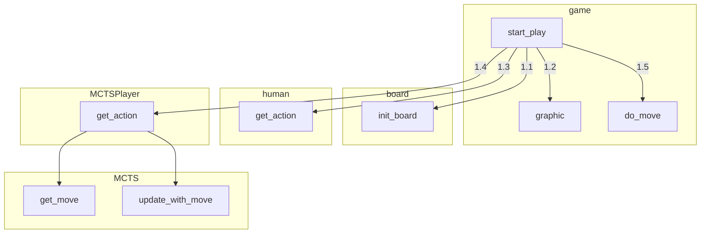

## 流程

```mermaid
graph TD;

subgraph game
a.1[start_play]
a.2[graphic]
a.3[do_move]
end

subgraph board
    b.1[init_board]
end

subgraph human
c.1[get_action]
end

subgraph MCTSPlayer
d.1[get_action]
end

subgraph MCTS
e.1[get_move]
e.2[update_with_move]
end


a.1--1.1-->b.1
a.1--1.2-->a.2
a.1--1.3-->c.1
a.1--1.4-->d.1
a.1--1.5-->a.3
d.1-->e.1
d.1-->e.2


 
```

1、梳理算法

2、梳理下顺联数据